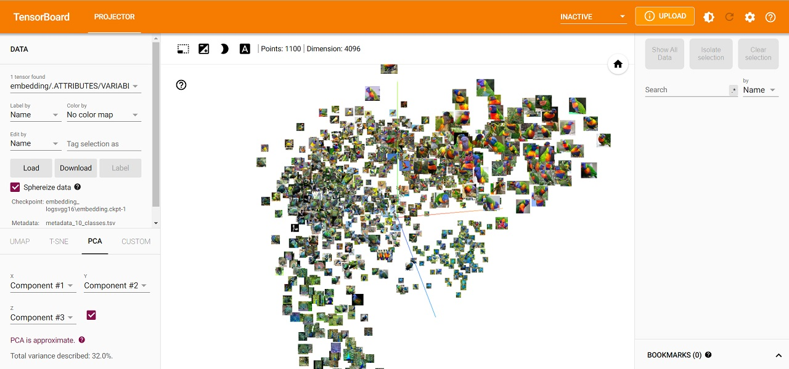

# Image Classification using Deep Learning and the Model Visualization in 3D Space Using TensorBoard

I collected this dataset from Kaggle. The data set has bird images belonging to 10 classes. These codes are examples of how to implement a 3-D visualization with the bird dataset classification and its embedded images. 
First, I built a Deep Learning Model for classifying the birds. I trained and validated the model and visualized the results on TensorBoard. It is a [good working example](Birds_Classification_and_visualize_the_model_using_TensorBoard_myModel.ipynb)
. However, the results were not that much of appealing. 

Then I did the transfer learning using VGG16 model. I visualized the results in the TensorBoard. The following video shows the results that I get from the customized  VGG16 model with transfer learning. **You can check the 3-D visualizing video by clicking on the following image.**

